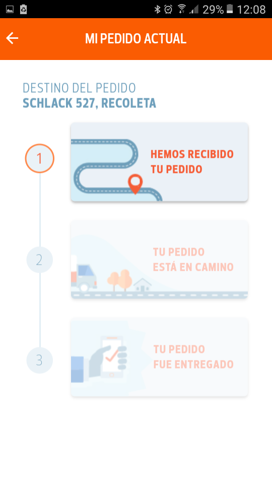

# Mejoras App Abastible

## Desarrollado para LABORATORIA

## Objetivos

- Mejorar la experiencia de los usuarios en una App que tenga bajas puntuaciones y descargas en plataformas como Play Store. logrando retener a quienes la utilizan mediante nuevas funcionalidades e información en el proceso de compra de balón, y seguimiento del pedido.

## ¿Cómo lo hicimos?

- Al comenzar el proceso realizamos una reunión donde como equipo UX y Front end Developer nos pusimos de acuerdo en que App selecionar y porque. Considerando los tiempos sin perder nuestro objetivo, llegamos a la conclusión de que la App selecionada seria Abastible.
Según sus caraterísticas visualmente es muy atractiva , hay coherencia entre un paso y otro , los elementos se mantienen y su lenguaje es cercano, pero ¿cuáles fueron los elementos que consideramos debían mejorarse?

- Al ingresar hay un registro con tu número celular, al cual te envían un código de confirmación para ingresar. Si el código no llega se genera uno automático, lo que deja con la sensación de que esto realmente no funciona.

- Nos enfocamos en el pedido del cilindro y en estos pasos en la parte de ingresar la dirección manualmente no carga la información que se ingresa ya que sólo debe ingresarse número de calle y numeración sin la comuna, esta información la conseguimos luego de hablar con un ejecutivo de call center y no se encuentra en el paso mencionado.

- Luego carga una imagen con una especie de botones con la descripción del balón más su valor ( ej: 5 kg $5.000 ) que eran netamente informativos pero daban la sensación de ser clickeables y tendían a confundir.

- En el paso de seleccionar el balón y la cantidad visualmente está todo ok , pero no está la descripción de los precios y a pesar de encontrarse dos pasos antes , creemos que debería estar en este paso, ya que se pueden olvidar.

- En el paso de seleccionar pagos, no está agregado el pago con tarjeta de crédito y aparece la compra con cupón , lo que es un descuento y no la compra completa con el cupón, si se compra con esta opción no se carga el despacho y no se entiende muy bien su función.

- **En la sección mis pedidos, existen tres pasos que indican “ hemos recibido tu pedido, tu pedido está en camino, tu pedido fue entregado” que son netamente informativas y se activan en la medida que avanza paso a paso , si el pedido fue despachado se activa “tu pedido está en camino” el cual puede estar activo durante horas si el pedido a tenido algún retraso o a sido reagendado , es en este punto donde encontramos nuestro insight y consideramos que la gran mejora podría generarse en este punto ya que se produce una gran sensación de incertidumbre por parte de los usuarios ya que no pueden ver realmente donde se encuentra su pedido y deben llamar al call center para verificar si realmente su pedido fue ingresado mediante la app.**

## Validando nuestra problemática

## Proceso

**Investigación**

- Teniendo nuestra hipótesis del problema nos encargamos de confirmar nuestras suposiciones, es por esto que revisamos en la web los reclamos más frecuentes , en la plataforma de play store comentarios y en reclamos.cl

- A demás de esto buscamos usuarios de la aplicación que ya hayan hecho un pedido y nos contaron su experiencia, en general se encuentra conforme con la app pero no así con el despacho, ya que quién tiene suerte recibe el pedido dentro de la hora de plazo, David parra, comenta que su despacho según el horario seleccionó llegó dos horas tarde y que esperar te hace perder tiempo ya que debes esperar en tu casa sin poder salir temiendo a que lleguen y no te encuentren. Y finalmente su pedido no llegó gracias a la app si no que, dentro de su búsqueda por respuestas encontró un número de whatsapp desde donde volvió a solicitar el gas.
También se hicieron llamadas al call center de abastible donde se les preguntó a los ejecutivos cuál era la pregunta o las consultas más frecuentes con respecto a  la app, y comentaban que las relacionadas con la llegada del despacho, confirmando si fue recibido, saber cuánto falta para que llegue y si existe algún problema  cuando están fuera del plazo de entrega.

- Realizamos un benchmark con parámetros de la evaluación en Usabilidad, comparando la App Abastible con otras App del rubro, en el cúal nos dimos cuenta que Abastible estaba por debajo de la competencia.

**Ideación**

**Sketch**

- Sin perder el objetivo quisimos rediseñar y dar un nueva funcionalidad a la sección que faltaba. Llegando al siguiente skecth.

- Pusimos en marcha nuestro wireframes de alta resolución para poder testearlo y medir su nueva funcionalidad. Lo cual resulto un éxito, obteniendo un buen feedback de los usuarios.

[LINK WIREFRAMES MARVELAPP HD V.1](https://marvelapp.com/85ge7i7/screen/40137366)

**Conclusión**

- Gracias a esta información confirmamos que los usuarios necesitan información sobre su despacho , nuestra idea fue agregar en el botón  “ tu pedido está en camino , la opción de darle seguimiento a tu despacho. El cual fue creado por las desarrolladoras de nuestro equipo con React.

Accede al repositorio de las desarrolladoras aquí: https://github.com/AGuerrav/hackathonReact_
